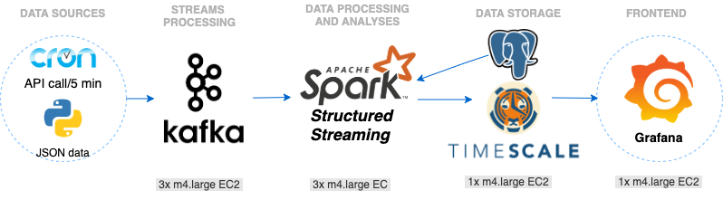

Insight-DE-project

### City Health Monitor  
***
Everybody is familiar with health monitoring devices like fitbit. Imagine Health Monitor for a City which captures set of measurements by its blocks. In my project I use real-time, location-based data about urban environment. And I build an application that allows users to track their exposure to certain air contaminants, or to navigate through the city avoiding urban heat islands, poor air quality, or excessive noise and congestion. Data can be used by individual residents as well as city health monitoring services
This project will empower people to make decisions to improve their own health and make cities more livable and eventually save costs in medical supplies/treatment.

### Tech Stack

- Data Storage: S3
- Data Base: Postgres 
- Kafka for streaming data
- Kafka Connect (Postgres)
- Spark for data capture and analyses 

### Data Source
- Historical Data from sensors (https://arrayofthings.github.io/) 
- API with 'Array of Things'. City of Chicago: https://api.arrayofthings.org/. API(1000 calls)

### DB Schema 
